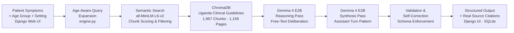

# 🏥 ClinAssist Uganda
### Offline Clinical Decision Support for the Last Mile

> ⚡ Runs fully offline. Grounded in Uganda's own national guidelines. Built for health centres where specialists don't exist.

**Track:** Health & Sciences &nbsp;·&nbsp; Global Resilience &nbsp;·&nbsp; Ollama Special Technology Track  
**Model:** Gemma 4 E2B via Ollama &nbsp;·&nbsp; **Stack:** Python · Django · ChromaDB · SQLite · sentence-transformers

---

## The Problem Is Not Knowledge. It's Access.

Uganda has **1 doctor for every 25,000 people**.

At a Health Centre III in rural Karamoja or Kasese, a single clinical officer sees 80+ patients a day. No specialist to call. No reliable internet. No time. One wrong decision — a missed malaria diagnosis in a 2-year-old, a paediatric dose given to an adult — can cost a life.

The Uganda Ministry of Health publishes comprehensive clinical guidelines. 1,158 pages of evidence-based protocols covering every condition from malaria to meningitis, maternal emergencies to childhood fever. The knowledge exists. It is peer-reviewed, government-endorsed, and freely available.

**It just never reaches the clinical officer at the moment they need it.**

I built ClinAssist to close that gap. Not with a chatbot. With a grounded, offline-capable, age-aware clinical decision support system that runs on a standard laptop and cites the exact page of the guideline it used.

---

## Demo

[](https://youtu.be/HZ8xT862mMI?si=CUhMQjmssHVkiEfE)

---

## What ClinAssist Does

A clinical officer types a patient's symptoms in plain language. ClinAssist runs a 4-step Clinical Intelligence Pipeline and returns:

- A **triage level** — Urgent / Moderate / Low — with a one-sentence clinical reason
- **Ranked differential diagnoses** with confidence scores (0–100%) and ICD-10 codes
- **Recommended investigations** with urgency flags (e.g. Malaria RDT — Urgent)
- **Age-appropriate treatment guidance** — correct dosing for adults, children under 5, school-age children, elderly, and pregnant women — never mixed
- **Red flags** to watch for before the next assessment
- **Source citations** — exact document, chapter, and page number from the Uganda Clinical Guidelines

Every output is grounded in retrieved guideline content. Not model intuition. Not internet data. The actual Uganda Clinical Guidelines 2023, Ministry of Health.

> 🔒 **100% offline after setup. Zero cloud dependency. Patient data never leaves the device.**

---

## Inference Pipeline



---

## How Each Stage Works

### Stage 1 — Input Layer (Django Web UI)

The clinical officer enters free-text symptoms and selects three parameters: age group (Adult / Elderly / Pregnant / Child 5–17 / Under 5), symptom duration, and facility setting. Patient records are stored locally in SQLite. For returning patients, the full visit history — previous symptoms, AI suggestions, confirmed diagnoses, known conditions, allergies, current medications — is automatically surfaced and injected into the analysis context.

No connectivity is required at this or any subsequent stage.

---

### Stage 2 — Age-Aware Query Expansion

Before retrieval, the engine constructs a semantically targeted query based on the patient's age group. This is not a simple keyword filter — it steers the entire embedding search toward the right section of the guidelines.

```python
# Adult patient — steers toward adult treatment sections
query = "Uganda clinical guidelines adult outpatient treatment management {symptoms}"

# Under-5 patient — steers toward IMCI and paediatric chapters  
query = "Uganda clinical guidelines child under five infant paediatric IMCI treatment {symptoms}"

# Pregnant patient — steers toward antenatal and maternal sections
query = "Uganda clinical guidelines pregnant woman antenatal maternal treatment safety {symptoms}"
```

Each age profile also carries `keep_words` (terms to promote) and `filter_words` (terms to penalise) for chunk scoring. A paediatric dose chunk scores -1 for an adult patient. An adult dose chunk scores -1 for an under-5 patient. The wrong content is filtered before Gemma ever sees it.

---

### Stage 3 — Contextual Retrieval (RAG)

`all-MiniLM-L6-v2` runs from local cache — no network call at inference time. The embedding model is downloaded once during setup and thereafter operates fully air-gapped.

The query embedding is compared against 1,967 chunk vectors stored in a local ChromaDB instance. The top 5 chunks by cosine similarity are retrieved, then re-ranked by the age-aware scoring function. A domain boost additionally promotes chunks from the clinically expected chapter — chunks from the Gastrointestinal chapter score +3 when the symptoms contain "stomach, vomiting, diarrhoea". Palliative care chunks score -3 for non-palliative queries.

The chunk metadata carries the exact document name, chapter (mapped from known UCG 2023 page ranges), and page number. This metadata is used directly for source citations — the LLM never generates citations.

```
[Source 1] Uganda Clinical Guidelines 2023 | Chapter 4: Malaria | p.231
[Source 2] Uganda Clinical Guidelines 2023 | Chapter 4: Malaria | p.235
[Source 3] Uganda Clinical Guidelines 2023 | Chapter 17: Childhood Illness | p.872
```

---

### Stage 4 — Reasoning Pass (Gemma 4 E2B — Free-Text Deliberation)

The retrieved guideline chunks and patient context are injected into a `REASONING_PROMPT`. Gemma 4 E2B is asked to think through the case in plain text — no format constraints, no schema.

```
Reason through this clinical case carefully:
1. What are the most likely diagnoses and why, based on the guideline evidence?
2. What features support or argue against each diagnosis?
3. What is the urgency level and why?
4. What investigations are needed to confirm the diagnosis?
5. What is the appropriate treatment for {age_group} per the Uganda Clinical Guidelines?
```

Gemma deliberates. It weighs the symptoms against the retrieved evidence, considers differentials, identifies which source supports which conclusion, and determines urgency. This reasoning is not shown to the clinical officer — it is the model's scratchpad. It is preserved as the **assistant turn** for Stage 5.

This stage is why the two-pass architecture was necessary. Single-pass inference produced a critical failure mode in early testing: the model would sometimes give paediatric doses to adult patients, or cite irrelevant guideline sections, because it was simultaneously trying to reason and format. Separating deliberation from synthesis eliminated this.

---

### Stage 5 — Structured Synthesis Pass (Gemma 4 E2B — Assistant Turn Pattern)

This is the architectural innovation borrowed from multi-turn conversation design.

The synthesis call does not start a new conversation. It **continues the existing one** — with the reasoning from Stage 4 injected as Gemma's own prior assistant message:

```python
response = ollama.chat(
    model="gemma4:e2b",
    messages=[
        {"role": "system",    "content": SYSTEM_PROMPT},
        {"role": "user",      "content": reasoning_prompt},   # Stage 4 input
        {"role": "assistant", "content": reasoning},          # Stage 4 output — injected here
        {"role": "user",      "content": synthesis_prompt},   # "now structure this as JSON"
    ]
)
```

Because Gemma is building on its own prior deliberation — completing its own thought — the structured output is forced to be consistent with the reasoning. The model cannot contradict itself. It cannot switch diagnoses between the reasoning and the JSON. It cannot forget the age group it was reasoning about.

The synthesis prompt enforces a strict JSON schema:

```json
{
  "triage":     {"level": "URGENT|MODERATE|LOW", "label": "...", "reason": "..."},
  "diagnoses":  [{"name": "...", "confidence": 0.85, "icd10": "...", "reasoning": "..."}],
  "tests":      [{"name": "...", "priority": "URGENT|ROUTINE", "rationale": "..."}],
  "treatments": [{"step": "First line|Second line|Supportive|Referral", "action": "...", "notes": "..."}],
  "red_flags":  ["...", "..."],
  "reasoning":  "2-3 sentence clinical summary",
  "disclaimer": "For clinical decision support only."
}
```

Sources are **not** requested in this prompt. They are always injected from Python chunk metadata after validation — eliminating hallucinated citations entirely.

---

### Stage 6 — Validation & Self-Correction

Output is validated against a required key schema. If any field is missing, the JSON is malformed, or confidence scores are out of range (the model occasionally returns 85 instead of 0.85), the exact error is passed back to Gemma with a correction prompt:

```python
# Broken output passed as assistant context — model fixes its own mistake
fix_response = ollama.chat(
    model="gemma4:e2b",
    messages=[
        {"role": "user",      "content": f"Your response had an error: {error}. Fix the JSON."},
        {"role": "assistant", "content": broken_output},
        {"role": "user",      "content": "Return only valid JSON now."},
    ]
)
```

Confidence scores are normalised automatically: integers in range 1–100 are converted to decimals 0.0–1.0. Maximum 2 retries before surfacing a clean error to the UI — never a silent failure.

After validation, the result's source list is always overwritten:

```python
# Sources from chunk metadata — never from LLM output
result["sources"] = _extract_sources(chunks)
```

---

## Why the Two-Pass Architecture

Single-pass inference failed in two specific ways that are unacceptable in a clinical tool:

**1. Age-group dosing errors.** The model would sometimes copy paediatric doses for adult patients because the retrieved chunks contained both. With the reasoning pass asking explicitly "what is the appropriate treatment for Adult (18+)?", this error was eliminated — the model commits to the age group in the reasoning before the synthesis locks it into the schema.

**2. Source hallucination.** The model invented plausible-sounding citations — chapter names and page numbers that did not exist. Grounding sources in Python chunk metadata rather than LLM generation eliminated this completely.

The assistant turn pattern — injecting reasoning as Gemma's own prior message — is what makes the synthesis reliable. The model completes its own thought. It does not start a new one.

---

## Why Gemma 4 E2B

These were not feature checkboxes. They were hard constraints for a tool that must run at a Health Centre III in rural Uganda.

| Requirement | Why It Mattered | Gemma 4 E2B |
|---|---|---|
| Runs on standard CPU | Field devices are basic laptops — no GPU | E2B quantization, 7.2GB, CPU-optimised |
| Offline after setup | No reliable connectivity during clinical use | One pull via Ollama, runs forever offline |
| Follows structured output | Clinical JSON must be machine-readable | Reliably produces schema-compliant output |
| Open weights | Clinical tools require full auditability | Fully open, inspectable, modifiable |
| Fine-tunable | Future: domain adaptation on Ugandan cases | Open weights enable Unsloth fine-tuning |
| Zero per-query cost | Health centres have no budget for cloud APIs | Local inference, zero ongoing cost |

---

## Project Structure

```
ClinIQ_Django/core/
│
├── manage.py
├── core/                      Django settings, URLs, WSGI
│
├── accounts/                  Authentication
│   ├── models.py              Custom User — role (doctor/admin), facility
│   ├── views.py               Login, register, profile
│   └── urls.py
│
├── patients/                  Patient Registry
│   ├── models.py              Patient — auto-generated ID, demographics, history
│   ├── views.py               List, search, create, edit
│   └── urls.py
│
├── diagnoses/                 Clinical Analysis
│   ├── models.py              Visit, Diagnosis — full JSON storage
│   ├── views.py               New visit, run analysis, save doctor notes
│   └── urls.py
│
├── reports/                   PDF Report Generation
│   ├── views.py               Date-range report, ReportLab PDF export
│   └── urls.py
│
├── ai/                        Clinical Intelligence Engine
│   ├── engine.py              4-step pipeline — retrieve, reason, synthesise, validate
│   ├── database.py            ChromaDB operations — embed, store, query
│   ├── knowledge_base.py      PDF ingestion — extract, chunk, detect chapter, index
│   └── prompts.py             SYSTEM_PROMPT, DRUG_REFERENCE_PROMPT
│
├── templates/                 Django HTML templates (9 files)
├── knowledge_base_docs/       Place clinical guideline PDFs here
├── chroma_db/                 Local ChromaDB vector store (auto-created)
└── clinassist.db              SQLite — patients, visits, diagnoses
```

---

## Quickstart

### Prerequisites
- Python 3.11+
- [Ollama](https://ollama.com) installed on your machine

### 1. Clone the repo
```bash
git clone https://github.com/YOUR_USERNAME/clinassist-uganda.git
cd clinassist-uganda/core
```

### 2. Create virtual environment and install
```bash
python -m venv venv
venv\Scripts\Activate.ps1      # Windows
pip install -r requirements.txt
```

### 3. Pull Gemma 4 via Ollama
```bash
ollama pull gemma4:e2b
```
> One-time download (~7.2GB). After this, the model runs fully offline — forever.

### 4. Index the knowledge base
```bash
mkdir knowledge_base_docs
# Place Uganda Clinical Guidelines 2023 PDF in knowledge_base_docs/
python .\ai\knowledge_base.py
python .\ai\knowledge_base.py --stats
```
> One-time indexing. Creates 1,967 chunks with chapter metadata. ~20 seconds.  
> To add more PDFs later: drop them in `knowledge_base_docs/` and re-run. No code changes needed.

### 5. Set up Django and run
```bash
python manage.py migrate
python manage.py createsuperuser
python manage.py runserver
```
Open: **http://localhost:8000**

---

## Offline Deployment: Hub-and-Spoke Model

ClinAssist uses the same hub-and-spoke deployment pattern used by global health organisations in low-connectivity environments.

1. **Provision once** at a regional centre or clinic with connectivity — pull Gemma, index PDFs, run setup
2. **Copy the entire project folder** to a USB drive
3. **Transfer and run** at any remote health facility — `python manage.py runserver` — no internet required, ever again

The entire stack — Ollama, Gemma 4 E2B, ChromaDB, SQLite, Django — is self-contained and portable. Other devices on the same facility WiFi connect via browser. No app install needed. Patient data in `clinassist.db` never leaves the device.

---

## Clinical Features

### Role-Based Access
Each clinical officer registers with a username, email, role (Doctor / Nurse / Admin), and facility name. Doctors see only their own patients. Admins see all patients across the facility. The Django admin panel gives full oversight.

### Patient Registry
- Auto-generated patient IDs: `CA-2026-00001`
- Search by name, ID, phone, or village
- Medical background: known conditions, allergies, current medications, next of kin
- Visit count and last visit date visible on the patient list

### Symptom Analysis
- Free-text symptom entry — plain language, no codes needed
- 5 age groups with distinct retrieval profiles
- 4-step pipeline runs automatically on submission
- Doctor annotation: confirm final diagnosis, add clinical notes post-analysis

### Visit History & Continuity
- Every visit stored permanently with complete AI output
- Returning patient history injected automatically into next analysis
- Audit trail: AI suggestion vs. doctor-confirmed diagnosis for every visit

### PDF Reports
- Date-range selection
- Downloadable PDF: patient table, triage levels, AI diagnoses, confirmed outcomes
- Summary stats: total visits, unique patients, urgent cases

---

## Knowledge Base

**Currently indexed:**
- Uganda Clinical Guidelines 2023 — Ministry of Health Uganda (1,158 pages → 1,967 chunks)

**Chapter mapping (UCG 2023 — page ranges):**

| Pages | Chapter |
|---|---|
| 31–80 | Chapter 1: Primary Health Care |
| 81–150 | Chapter 2: Communicable Diseases |
| 151–220 | Chapter 3: HIV/AIDS |
| 221–290 | Chapter 4: Malaria |
| 291–360 | Chapter 5: Tuberculosis |
| 361–445 | Chapter 6: Gastrointestinal and Hepatic Diseases |
| 446–485 | Chapter 7: Renal and Urinary Diseases |
| 486–565 | Chapter 9: Mental, Neurological and Substance Use |
| 566–620 | Chapter 11: Blood Diseases |
| 621–700 | Chapter 13: Palliative Care |
| 831–950 | Chapter 17: Childhood Illness |
| 951–1035 | Chapter 23: Non-Communicable Diseases |
| 1036–1100 | Chapter 24: Surgery and Anaesthesia |

**Adding more PDFs:** Drop any PDF into `knowledge_base_docs/` and run `python .\ai\knowledge_base.py`. For non-UCG PDFs, chapter detection falls back to topic keyword scanning — no code changes needed.

All source PDFs freely available at: https://www.health.go.ug/publications

---

## Honest Notes on Limitations

**Response time is 2–4 minutes on a standard CPU.**  
This is the cost of two full Gemma 4 inference passes on a 7.2GB model without a GPU. Acceptable for a clinical consultation — the officer examines the patient while the analysis runs.

For context: **3 minutes is faster than the real alternative** — a referral to the nearest specialist, who may be a 6-hour bus ride away and a 6-month wait.

**ClinAssist does not replace clinical judgment.**  
It is a decision support tool. The clinical officer's examination and professional judgment remain primary. Every screen carries the disclaimer. Confidence scores surface uncertainty. Source citations allow verification in seconds.

**Retrieval quality improves with more PDFs.**  
With one document, some conditions retrieve from adjacent chapters. Adding disease-specific guidelines — a dedicated malaria treatment manual, IMCI guidelines — significantly improves source accuracy for those conditions.

**Validation is in progress.**  
The system has been tested against known clinical cases from the UCG. Formal prospective validation with clinical officers at Ugandan health facilities is the immediate next step.

---

## Real-World Impact

**Immediate.** Any health facility in Uganda can deploy ClinAssist today on a standard laptop. Zero per-query cost. Zero cloud dependency. Zero subscription.

**Scale.** The same architecture replicates for any country's national clinical guidelines. Kenya, Tanzania, Rwanda, Ethiopia — each has equivalent MOH protocols. Drop in the PDF, re-index, deploy.

**Validation path.** Pilot with 3–5 Health Centre IIIs in Uganda → clinical officer feedback on accuracy and usability → formal validation with Makerere University School of Medicine → submission to MOH Uganda digital health registry.

---

## Roadmap

The next phase uses Gemma 4's multimodal architecture. A clinical officer photographs a patient's presentation — rash, wound, eye condition, nutritional status — and ClinAssist adds visual assessment to the symptom analysis pipeline. Gemma 4 E2B was chosen specifically because its architecture supports multimodal input without rewriting the inference pipeline. The RAG retrieval, SQLite history, self-correction loop, and offline deployment model all transfer directly.

**The core system is already built for this. The input layer is what changes.**

---

## License

MIT License

---

*Knowledge base: Uganda Clinical Guidelines 2023, Ministry of Health Uganda. For clinical decision support only. Always apply professional examination and judgment. This tool does not replace a qualified health worker.*
